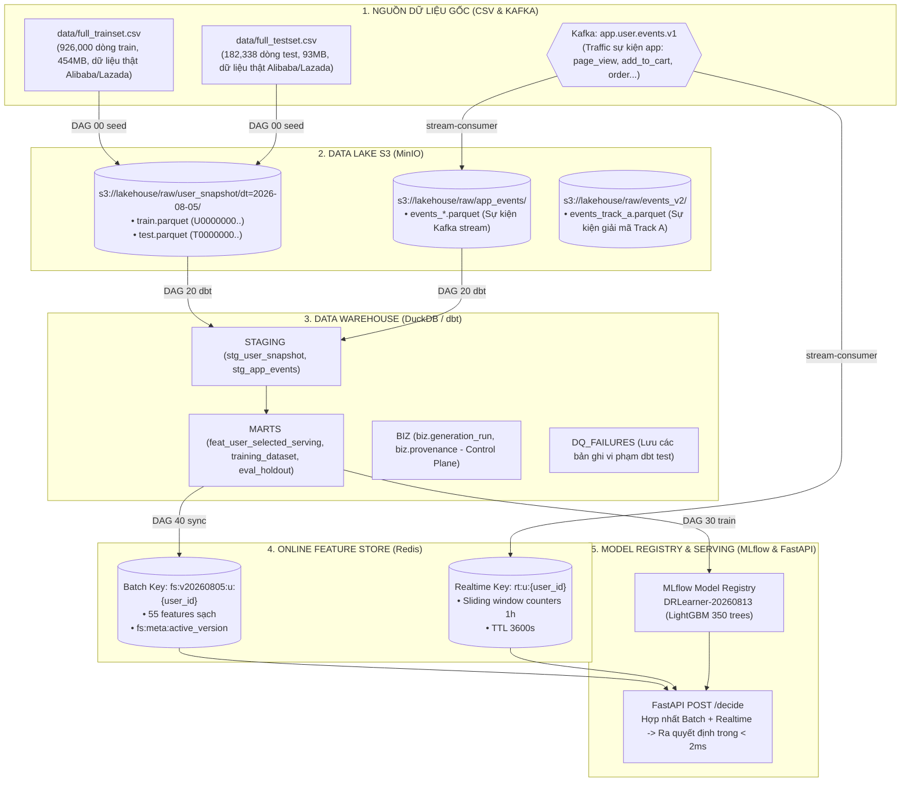

# Tài liệu Kiến trúc Dữ liệu, Airflow DAGs & dbt Transformations

Tài liệu này giải thích chi tiết và trực quan toàn bộ hệ thống: **Bản chất dữ liệu đang lưu trữ**, **Tất cả các Airflow DAGs đang vận hành**, **Các đoạn code Python tương ứng**, và **Cách dbt chuyển đổi dữ liệu từ thô sang Feature Store**.

---

## 1. Bức tranh Dữ liệu trong Hệ thống (Data Architecture)

Hệ thống quản lý dữ liệu qua 5 tầng lưu trữ chuyên biệt:



---

## 2. Chi tiết 8 Airflow DAGs trong Hệ thống

| DAG ID | Tên DAG | Lịch chạy (`schedule`) | File DAG | Module Code thực thi |
| :--- | :--- | :--- | :--- | :--- |
| **`00_bootstrap_lake`** | Khởi tạo Data Lake | `None` (Chạy 1 lần) | [dag_00_bootstrap_lake.py](file:///Users/user/Intern/LZD/airflow/dags/dag_00_bootstrap_lake.py) | `lzd_pipeline.ingestion.seed_loader` |
| **`10_ingest_stream_to_lake`** | Đồng bộ Stream sang Lake | `*/15 * * * *` (15 phút/lần) | [dag_10_ingest_stream_to_lake.py](file:///Users/user/Intern/LZD/airflow/dags/dag_10_ingest_stream_to_lake.py) | `lzd_pipeline.ingestion.stream_consumer` |
| **`20_build_features_dbt`** | Xây dựng Feature Marts | `0 1 * * *` (01:00 hàng ngày) | [dag_20_build_features_dbt.py](file:///Users/user/Intern/LZD/airflow/dags/dag_20_build_features_dbt.py) | `dbt-duckdb`, `offline_store.py` |
| **`30_train_uplift_model`** | Huấn luyện Model Uplift | `0 2 * * 0` (Chủ nhật 02:00) | [dag_30_train_uplift_model.py](file:///Users/user/Intern/LZD/airflow/dags/dag_30_train_uplift_model.py) | `training.train`, `training.dr_learner` |
| **`40_sync_features_to_redis`** | Đồng bộ Features lên Redis | `30 1 * * *` (01:30 hàng ngày) | [dag_40_sync_features_to_redis.py](file:///Users/user/Intern/LZD/airflow/dags/dag_40_sync_features_to_redis.py) | `features.sync`, `features.online_store` |
| **`50_data_quality`** | Giám sát Chất lượng Dữ liệu | `0 3 * * *` (03:00 hàng ngày) | [dag_50_data_quality.py](file:///Users/user/Intern/LZD/airflow/dags/dag_50_data_quality.py) | `common.audit` |
| **`60_reconstruction_e2e`** | Động cơ Giải mã Track A | `None` (Trigger tay) | [dag_60_reconstruction_e2e.py](file:///Users/user/Intern/LZD/airflow/dags/dag_60_reconstruction_e2e.py) | `reconstruction.track_a_batch` |
| **`99_ops_toolbox`** | Hộp công cụ Vận hành | `None` (On-demand) | [dag_99_ops_toolbox.py](file:///Users/user/Intern/LZD/airflow/dags/dag_99_ops_toolbox.py) | `features.sync`, `common.clients` |

---

### Chi tiết từng DAG:

### 1. `00_bootstrap_lake` (Khởi tạo Nền tảng Lakehouse)
- **Mục đích:** Nạp dữ liệu snapshot ban đầu từ 2 file CSV gốc (~657MB) lên MinIO Data Lake và tạo cấu trúc DuckDB.
- **Các Tasks:**
  1. `create_schemas`: Tạo 5 schema trong DuckDB (`raw`, `staging`, `marts`, `dq_failures`, `biz`). Dựng sẵn bảng vỏ rỗng cho schema `biz.*`.
  2. `seed_csv`: Đọc `full_trainset.csv` và `full_testset.csv`, chuẩn hoá ID (`U0000000..` cho train, `T0000000..` cho test), nén Parquet nạp lên `s3://lakehouse/raw/user_snapshot/dt=2026-08-05/`.
  3. `verify_lake`: Đọc ngược lại từ MinIO đếm đủ 1,108,338 bản ghi và gửi metric `bootstrap_raw_rows` lên Prometheus.

---

### 2. `20_build_features_dbt` (Biến đổi & Kiểm định Feature bằng dbt)
- **Mục đích:** Chạy dbt để biến đổi dữ liệu snapshot thô và sự kiện streaming thành các Feature Marts phục vụ cả Offline Training và Online Serving.
- **Các Tasks:**
  1. `dbt_debug`: Kiểm tra kết nối tới kho dữ liệu DuckDB `warehouse.duckdb`.
  2. `dbt_run`: Thực thi dbt biên dịch và build 8 models.
  3. `assert_spec_contract`: Kiểm tra chống Skew xem bảng `feat_user_selected_serving` có đủ 55 features khớp 100% với file cấu hình `feature_spec.yml`.
  4. `dbt_test`: Chạy 33 bài kiểm định tự động (unique ID, not_null, accepted_values, positive GMV).
  5. `publish_dbt_results`: Đọc file `run_results.json` của dbt, bóc tách lỗi và ghi lịch sử vào bảng audit Postgres `ops.dq_result` + Pushgateway.
  6. `profile_features`: Tính null rate từng cột, độ tươi của bảng (freshness), tỷ lệ treatment ratio và gửi lên Grafana.

---

### 3. `30_train_uplift_model` (Huấn luyện Mô hình Machine Learning Uplift)
- **Mục đích:** Huấn luyện thuật toán Causal Inference **DR-Learner (Doubly Robust)** để ước lượng hiệu ứng gia tăng (Treatment Effect) của voucher.
- **Các Tasks:**
  1. `load_data`: Đọc tập huấn luyện `marts.training_dataset` và tập đánh giá đóng băng `marts.eval_holdout`.
  2. `train_dr_learner`: Huấn luyện 2 mô hình phân loại Nuisance (Propensity Model $e(X)$ và Outcome Model $\mu(X, W)$) + 1 mô hình hồi quy Effect Model $\tau(X)$ (350 cây LightGBM).
  3. `evaluate_qini`: Đo lường đường cong Qini Curve, diện tích AUUC và Uplift@30%.
  4. `register_and_promote`: Nếu mô hình mới có $Qini > Qini_{hiện\_tại} + \epsilon$, tự động đăng ký vào MLflow Model Registry và chuyển alias `Production`.

---

### 4. `40_sync_features_to_redis` (Đồng bộ 55 Features lên Redis Online Store)
- **Mục đích:** Đồng bộ 1.1 triệu bản ghi đặc trưng từ DuckDB lên Redis với cơ chế Sharding, Zero-downtime Atomic Swap và Validation.
- **Các Tasks:**
  1. `prepare_sync`: Tạo version mới `v20260805`, chia 1,108,338 dòng thành 8-32 shards.
  2. `sync_shard` *(chạy song song)*: Đọc từng shard từ `marts.feat_user_selected_serving` và ghi vào Redis key `fs:v20260805:u:{user_id}` qua pipeline.
  3. `summarize_shards`: Tổng hợp số dòng các shard, xác nhận đủ 100% số lượng bản ghi.
  4. `validate_sample`: Rút ngẫu nhiên 500-1,000 users, đọc từ Redis đối chiếu từng con số với DuckDB (0% mismatch).
  5. `activate_version`: Chạy Lua script nguyên tử đổi con trỏ `fs:meta:active_version = v20260805`.
  6. `gc_old_versions`: Đặt TTL 24h dọn dẹp các version cũ để giải phóng RAM Redis.

---

### 5. `60_reconstruction_e2e` (Động cơ Giải mã Ngược Track A)
- **Mục đích:** Dùng thuật toán Solver $H_1$ giải mã 55 đặc trưng snapshot thành chuỗi sự kiện hành vi quá khứ thô ($T < T_0$).
- **Các Tasks:**
  1. `contract_dry_run`: Kiểm định 6 cổng Gate A..F trên 1 target mẫu giả định.
  2. `backfill_train_split`: Giải mã $N$ users thật từ `full_trainset.csv`, kiểm định độ khớp bit-for-bit qua Gate A..F, sau đó land dữ liệu vào 3 nơi: Postgres `biz.*`, DuckDB `biz.*`, và MinIO `raw/events_v2/`.

---

## 3. Tầng dbt Xử lý Dữ liệu như thế nào? (dbt Transformation Layer)

Thư mục `dbt/models/` gồm 8 models chuyển đổi dữ liệu qua 2 tầng:

```
dbt/models/
├── staging/
│   ├── stg_user_snapshot.sql       (View: Ép kiểu dữ liệu f0..f82, tách U.../T... ID)
│   └── stg_app_events.sql          (View: Đọc sự kiện streaming từ Parquet MinIO)
└── marts/
    ├── feat_user_behaviour.sql     (Table: Tính tenure_days, GMV 30d, order_cnt_30d)
    ├── feat_user_realtime_pit.sql  (Table: Tính Point-in-Time events 1h từ stream)
    ├── feat_user_selected_serving.sql (Table + Index: LỌC ĐÚNG 55 FEATURES SYNC REDIS)
    ├── feat_user_serving.sql       (View: Baseline mart chứa full 83 đặc trưng f0..f82)
    ├── eval_holdout.sql            (View: Tập đánh giá testset ĐÓNG BĂNG cho MLflow)
    └── training_dataset.sql        (View: Tập train kết hợp Batch + Realtime + Label)
```

### Chi tiết các Models chính:

#### 1. `stg_user_snapshot.sql`
- Đọc trực tiếp từ file Parquet trên MinIO `s3://lakehouse/raw/user_snapshot/**/*.parquet`.
- Ép kiểu dữ liệu an toàn cho 83 cột ($f_0..f_{82}$) sang `DOUBLE` / `BIGINT`.
- Tách nhãn `label` và `is_treat` riêng để chống rò rỉ dữ liệu (Data Leakage).

#### 2. `feat_user_selected_serving.sql`
- **Đây là nguồn dữ liệu duy nhất được DAG 40 đọc để sync lên Redis.**
- Lọc chính xác **55 đặc trưng** nằm trong hợp đồng `feature_spec.yml` (7 biến hành vi T1, 24 biến thuộc tính T2, 24 biến tiềm ẩn T3).
- Tạo index `idx_feat_selected_serving_user` trên cột `user_id` để tối ưu hóa tốc độ đọc khi chia shard.

#### 3. `training_dataset.sql` & `eval_holdout.sql`
- Ghép 55 đặc trưng tĩnh với các biến hành vi streaming vừa phát sinh (`feat_user_realtime_pit`).
- Nối lại với cột nhãn `label` và cờ can thiệp `is_treat` để phục vụ riêng cho DAG 30 huấn luyện mô hình ML.

---

## 4. Bảng Tra cứu Mã Lệnh Thao tác Nhanh

```bash
# 1. Chạy kịch bản tích hợp toàn diện (Track A -> Redis -> Track B -> Kafka -> API):
PYTHONPATH=src .venv/bin/python scripts/demo_track_ab_e2e.py

# 2. Chạy dbt trực tiếp:
docker compose exec airflow-scheduler bash -c "cd /opt/project/dbt && dbt run --no-version-check --exclude tag:reconstruction --vars '{\"run_date\": \"1970-01-01\"}'"

# 3. Chạy 33 bài dbt data tests:
docker compose exec airflow-scheduler bash -c "cd /opt/project/dbt && dbt test --no-version-check --exclude tag:reconstruction --vars '{\"run_date\": \"1970-01-01\"}'"

# 4. Kiểm tra danh sách DAG và trạng thái trên Airflow:
docker compose exec airflow-scheduler airflow dags list
docker compose exec airflow-scheduler airflow dags list-runs -d 20_build_features_dbt

# 5. Kiểm tra Feature Store trên Redis:
curl -s http://localhost:8000/store/info | python3 -m json.tool
curl -s http://localhost:8000/features/U0000001 | python3 -m json.tool

# 6. Gửi request suy luận tới Inference API:
curl -s -X POST http://localhost:8000/decide \
  -H "Content-Type: application/json" \
  -d '{"user_id": "U0000001"}' | python3 -m json.tool
```
