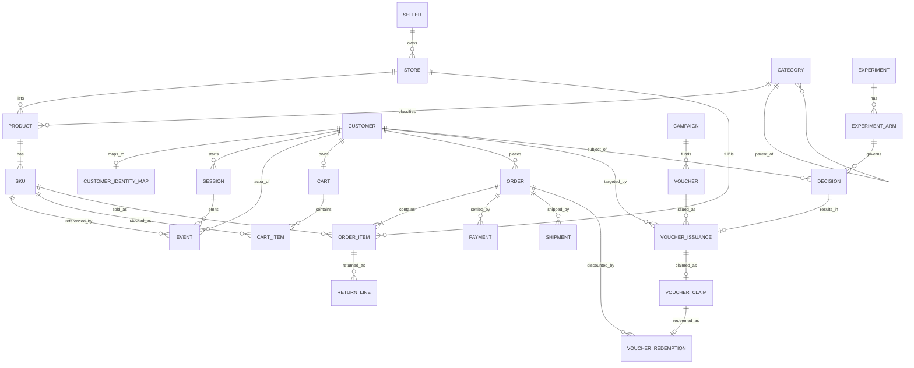

# ERD — Synthetic Lazada Business System

> **Vai trò:** Layer 1 (Operational Database) — nguồn sinh ra mọi raw event.
>
> **Trạng thái:** DDL reconstruction đã có trong `sql/postgres/02_biz_reconstruction.sql`;
> volume Postgres cũ cần được migrate/recreate để nhận các bảng mới.
>
> ⚠️ Đây là **synthetic reconstruction**, không phải schema nội bộ của Lazada.
> Xem `LAZADA_BUSINESS_DOMAIN.md` cho nhãn FACT / INFERENCE / SYNTHETIC của từng
> giả định nghiệp vụ đứng sau các entity dưới đây.
>
> 🚫 **Không có cột `f0`..`f82` nào trong ERD này.** Chúng thuộc Layer 3 (feature),
> không phải Layer 1.
>
> Thay vào đó, ERD chứa các **thuộc tính nghiệp vụ synthetic** (§3.1a) mà feature
> engineering **xuôi chiều** sẽ tái tạo `f*` từ đó — cơ chế **Constrained Forward
> Synthesis**, xem `FEATURE_LINEAGE.md` §3.

---

## Mục lục

1. [Nguyên tắc thiết kế](#1-nguyên-tắc-thiết-kế)
2. [Sơ đồ tổng thể](#2-sơ-đồ-tổng-thể)
3. [Domain A — Identity & Catalog](#3-domain-a--identity--catalog)
4. [Domain B — Behaviour](#4-domain-b--behaviour)
5. [Domain C — Transaction](#5-domain-c--transaction)
6. [Domain D — Promotion](#6-domain-d--promotion)
7. [Domain E — Decisioning](#7-domain-e--decisioning)
8. [Lifecycle của các entity có trạng thái](#8-lifecycle-của-các-entity-có-trạng-thái)
9. [Ma trận cardinality](#9-ma-trận-cardinality)
10. [Entity bị loại — và lý do](#10-entity-bị-loại--và-lý-do)
11. [Business transaction flows](#11-business-transaction-flows)

---

## 1. Nguyên tắc thiết kế

| # | Nguyên tắc | Hệ quả cụ thể |
|---|---|---|
| **N1** | Mỗi entity phải trả lời được: **feature nào cần nó?** | Xem cột "Biện minh" ở mỗi bảng. Không có feature ⇒ không có entity |
| **N2** | ERD **không** chứa feature | Không cột `f*`, không `hist_*`, không `rt_*`. ERD chứa *sự kiện nghiệp vụ*, feature là *hàm* của chúng |
| **N3** | Mọi transition trạng thái sinh **đúng một** domain event | Xem `BUSINESS_EVENT_MODEL.md`. Không có transition câm |
| **N4** | Treatment là một **bản ghi nghiệp vụ**, không phải cột phái sinh | `VOUCHER_ISSUANCE` là entity hạng nhất — nó *là* treatment |
| **N5** | Quyết định của model là **dữ liệu nghiệp vụ** | `DECISION` nằm trong ERD, không chỉ trong log ops. Đây là thứ đóng closed loop |
| **N6** | Không gian ID tách biệt với dataset LZD | `CUSTOMER.customer_id` (`C…`) ≠ `user_id` LZD (`U…`); nối bằng `CUSTOMER_IDENTITY_MAP` (ASSUMPTION A-04) |
| **N7** | Giá sống ở **SKU**, không ở event | Event tham chiếu `sku_id`; giá tra từ SKU tại thời điểm giao dịch |

---

## 2. Sơ đồ tổng thể



### 2.1 · Năm domain

```
┌─────────────────────────┐  ┌──────────────────────┐
│ A · IDENTITY & CATALOG  │  │ B · BEHAVIOUR        │
│ SELLER STORE CATEGORY   │  │ SESSION  EVENT       │
│ PRODUCT SKU CUSTOMER    │  │ CART  CART_ITEM      │
│ CUSTOMER_IDENTITY_MAP   │  └──────────┬───────────┘
└───────────┬─────────────┘             │
            │                           │
            └───────────┬───────────────┘
                        ▼
        ┌──────────────────────────────────┐
        │ C · TRANSACTION                  │
        │ ORDER ORDER_ITEM PAYMENT         │
        │ SHIPMENT RETURN_LINE             │
        └───────────┬──────────────────────┘
                    ▲
                    │ discount
        ┌───────────┴──────────────────────┐
        │ D · PROMOTION                    │
        │ CAMPAIGN VOUCHER                 │
        │ VOUCHER_ISSUANCE ← TREATMENT     │
        │ VOUCHER_CLAIM VOUCHER_REDEMPTION │
        └───────────▲──────────────────────┘
                    │ issues
        ┌───────────┴──────────────────────┐
        │ E · DECISIONING                  │
        │ DECISION  EXPERIMENT  ARM        │
        └──────────────────────────────────┘
                    ▲
                    │ closed loop: feature → model → decision → issuance → event
```

---

## 3. Domain A — Identity & Catalog

### 3.1 · `CUSTOMER`

| Cột | Kiểu | Khoá | Ghi chú |
|---|---|---|---|
| `customer_id` | TEXT | **PK** | Định dạng `C0000001` |
| `registered_at` | TIMESTAMPTZ | | Mốc tính `tenure` **thật** |
| `country` | TEXT | | 🟨 enum: `VN,TH,ID,MY,PH,SG` |
| `city_tier` | SMALLINT | | 🟨 1–3 |
| `preferred_platform` | TEXT | | `web,android,ios` |
| `member_tier` | TEXT | | 🟨 `NORMAL,SILVER,GOLD,PLATINUM` |
| `is_active` | BOOLEAN | | |
| `created_at` / `updated_at` | TIMESTAMPTZ | | |

**Biện minh:** entity chủ thể của quyết định. `registered_at` là nguồn **duy nhất
đúng** cho `user_tenure_days` — sửa lỗi hiện tại (xem `FEATURE_DICTIONARY.md`, mục
`user_tenure_days`, nơi tenure đang bị tính từ event đầu tiên **trong cửa sổ 30 ngày**
nên bị chặn trên ở 30). `country`/`city_tier`/`member_tier` là nguồn categorical
tự nhiên — đối chiếu với ràng buộc §9.1-4 của business domain (dataset có ≥7 categorical).

#### 3.1a · Thuộc tính CFS trên `CUSTOMER`

Đây là các thuộc tính do **Constrained Forward Synthesis** đưa vào
(`FEATURE_LINEAGE.md` §6). Chúng **không phải** cột `f*` — chúng là **nguồn nghiệp vụ
synthetic** mà feature engineering xuôi chiều sẽ tái tạo `f*` từ đó.

| Cột | Kiểu | Tái tạo cột nào | Tier | Ghi chú |
|---|---|---|---|---|
| `synthetic_segment_g1` … `g8` | TEXT | `f40`–`f78` | T2 | **8** biến, không phải 39. Sau khử trùng (`f68≡f71≡f77`, `f78≡f69≡f72`, `f70` hằng số). `fs_2026_08_v2` dùng `g1` `g2` `g3` `g4` `g6`; `g5` `g7` `g8` chưa được chọn |
| `synthetic_category_515` | TEXT | `f79`, `f80`, `f81`, `f82` | T2 | ★ **MỘT** thuộc tính → **bốn** encoding. Song ánh (C19) |
| `synthetic_attr_64` | TEXT | `f37` | T2 | 64 mức |
| `synthetic_attr_241` | TEXT | `f38` | T2 | 241 mức. **Tách khỏi `f37`** — tuple cardinality 1133 > 241 (C21) |
| `attr_date_a`, `attr_date_b` | DATE | `f1`, `f2` | T1 | ràng buộc `attr_date_a ≤ attr_date_b` ⇒ `f1 ≥ f2` tự thoả |
| `synthetic_ordinal_a`, `_b` | SMALLINT | `f0`, `f7` | T1\|T2 | 6 mức `{0..5}`. Hai biến khác nhau (C22) |
| `synthetic_score_a`, `_b` | SMALLINT | `f27`, `f34` | T1\|T2 | `[0,100]` |

**Cột T1 dạng counter** (`f18`, `f19`, `f30`) **không** nằm ở đây — chúng được tái tạo
bằng cách **sinh đúng `n = round(10^f)` event**, không phải bằng thuộc tính. Đó chính
là điểm khác nhau giữa T1 và T2.

> `[MEASURED]` **Cấu trúc thật của khối `f40`–`f78`** — đo trên toàn bộ 926,669 dòng
> train, kiểm lại trên 181,669 dòng test:
>
> | Group | Cột | Mức | `sum == 1` train | test | Trong `fs_2026_08_v2` |
> |---|---|---|---|---|---|
> | `g1` | `f40` `f41` `f42` | 3 | ✅ | ✅ | chọn **3/3** |
> | `g2` | `f43`–`f52` | 10 | ✅ | ✅ | chọn 6/10 |
> | `g3` | `f53`–`f62` | 10 | ✅ | ✅ | chọn 6/10 |
> | `g4` | `f63` `f64` `f65` | 3 | ✅ | 🔴 **VỠ** | chọn 2/3 |
> | `g5` | `f66` `f67` | 2 | ✅ | ✅ | — |
> | `g6` | `f68` `f78` | 2 | ✅ | ✅ | chọn 1/2 |
> | `g7` | `f73` `f74` | 2 | ✅ | ✅ | — |
> | `g8` | `f75` `f76` | 2 | ✅ | ✅ | — |
>
> Cộng thêm `f70` ≡ 1.0 và 4 cột trùng khít (`f69` `f71` `f72` `f77`) ⇒
> `row_sum(f40..f78) = 11.0` ở 100% dòng.
>
> 🔴 `g4`: `sum(f63,f64,f65) == 0` ở **3/181,669** dòng test, 0 dòng train ⇒ attribute
> thật có **mức baseline toàn-0** không xuất hiện trong train. Vậy `synthetic_segment_g4`
> có **4 mức**, không phải 3. `split_allowed: train` nên chưa nổ ra.
> 🚫 Không mở scope sang test trước khi xử lý mức thứ tư.

> ⚠️ **Ràng buộc X1 (`MIGRATION_PLAN.md` MX):** các thuộc tính trên **phải thực sự
> điều khiển hành vi mô phỏng** (xác suất mua, giá trị giỏ, phản ứng voucher). Nếu chỉ
> lưu rồi phát lại nguyên xi thì đó là **copy trá hình**, không phải feature engineering.
>
> 🚫 Semantic thật của các thuộc tính này là **UNKNOWN**. Tên `synthetic_*` là cố ý —
> nó nhắc rằng đây là `SYNTHETIC_ASSUMPTION`, không phải thuộc tính Lazada có thật.

### 3.2 · `CUSTOMER_IDENTITY_MAP`

| Cột | Kiểu | Khoá |
|---|---|---|
| `customer_id` | TEXT | **PK**, FK → `CUSTOMER` |
| `lzd_user_id` | TEXT | UNIQUE — `U0000123` |
| `lzd_split` | TEXT | `train` \| `test` |
| `bound_at` | TIMESTAMPTZ | |

**Biện minh:** ASSUMPTION A-04. Đây là **cây cầu duy nhất** giữa synthetic business
system và dataset LZD. Giải quyết gap **G3** (producer bịa user không tồn tại).

> **Ràng buộc bắt buộc:** scenario driver **chỉ** được chạy trên customer có mặt
> trong bảng này với `lzd_split = 'train'`. Cấm dùng `test` — test set là tài sản
> đánh giá RCT duy nhất (audit §5.4).

### 3.3 · `SELLER` / `STORE`

| `SELLER` | Kiểu | Khoá |
|---|---|---|
| `seller_id` | TEXT | **PK** |
| `seller_type` | TEXT | 🟩 `MARKETPLACE_3P` \| `RETAIL_1P` \| `CROSS_BORDER` |
| `onboarded_at` | TIMESTAMPTZ | |
| `country` | TEXT | |

| `STORE` | Kiểu | Khoá |
|---|---|---|
| `store_id` | TEXT | **PK** |
| `seller_id` | TEXT | FK → `SELLER` |
| `is_lazmall` | BOOLEAN | 🟩 tầng premium |
| `rating_avg` | NUMERIC(3,2) | 🟨 |
| `created_at` | TIMESTAMPTZ | |

**Biện minh:** `is_lazmall` + `seller_type` là thuộc tính categorical có tác động
hành vi thật (🟩 FACT §2.1–2.2). Cần cho feature "tỉ trọng chi tiêu ở LazMall" và
cho **scope của store voucher** (§6.2).

### 3.4 · `CATEGORY` / `PRODUCT` / `SKU`

| `CATEGORY` | Kiểu | Khoá |
|---|---|---|
| `category_id` | TEXT | **PK** |
| `parent_category_id` | TEXT | FK → `CATEGORY` (self, nullable) |
| `level` | SMALLINT | 1..3 |
| `commission_rate` | NUMERIC(4,3) | 🟩 1–4% tuỳ ngành |

| `PRODUCT` | Kiểu | Khoá |
|---|---|---|
| `product_id` | TEXT | **PK** |
| `store_id` | TEXT | FK → `STORE` |
| `category_id` | TEXT | FK → `CATEGORY` |
| `title` | TEXT | |
| `listed_at` | TIMESTAMPTZ | |
| `is_active` | BOOLEAN | |

| `SKU` | Kiểu | Khoá |
|---|---|---|
| `sku_id` | TEXT | **PK** |
| `product_id` | TEXT | FK → `PRODUCT` |
| `variant_label` | TEXT | vd `"M / Đen"` |
| `list_price` | NUMERIC(12,2) | **giá gốc — nguồn sự thật** |
| `stock_qty` | INT | |

**Biện minh (N7):** giá phải sống ở một chỗ. Repo hiện tại sinh `price` ngẫu nhiên
**trong từng event**, nên cùng một item có giá khác nhau giữa hai event ⇒ `rt_gmv_1h`
và `hist_gmv_30d` không nhất quán với bất kỳ catalog nào. Có SKU thì GMV trở thành
đại lượng **kiểm chứng được**: `gmv = Σ(unit_price × qty)` và `unit_price` truy được
về `SKU.list_price` cùng discount đã áp.

**Về cardinality:** `CATEGORY` cấp 3 nên có bậc **~500 mức** — đối chiếu ràng buộc
§9.1-5 (dataset có 1 categorical ~515 mức). 🟦 Đây là **INFERENCE về mặt cấu trúc**,
❌ **không** phải khẳng định `f79..f82` là category. Xem `FEATURE_LINEAGE.md` §5.

---

## 4. Domain B — Behaviour

### 4.1 · `SESSION`

| Cột | Kiểu | Khoá | Ghi chú |
|---|---|---|---|
| `session_id` | TEXT | **PK** | |
| `customer_id` | TEXT | FK → `CUSTOMER` | |
| `platform` | TEXT | | `web,android,ios` |
| `started_at` | TIMESTAMPTZ | | |
| `ended_at` | TIMESTAMPTZ | | NULL khi đang mở |
| `entry_channel` | TEXT | | 🟨 `ORGANIC,PUSH,ADS,EMAIL` |

**Biện minh:** `rt_session_len_sec` **hiện đang là một offline/online feature skew có thật**
(audit C16) một phần vì online không có khái niệm session — chỉ có counter theo user.
Có entity SESSION với `started_at` rõ ràng thì độ dài phiên trở thành đại lượng có
định nghĩa duy nhất ở cả hai phía. `entry_channel` là biến exposure marketing (§6 yêu cầu).

### 4.2 · `EVENT`

Đây là bảng append-only, **cầu nối Layer 1 → Layer 2**.

| Cột | Kiểu | Khoá | Ghi chú |
|---|---|---|---|
| `event_id` | TEXT | **PK** | UUID — dùng dedup |
| `customer_id` | TEXT | FK → `CUSTOMER` | |
| `session_id` | TEXT | FK → `SESSION` | nullable (event hệ thống) |
| `event_type` | TEXT | | xem `BUSINESS_EVENT_MODEL.md` |
| `event_ts` | TIMESTAMPTZ | | thời điểm **xảy ra** |
| `sku_id` | TEXT | FK → `SKU` | nullable |
| `product_id` | TEXT | FK → `PRODUCT` | nullable |
| `category_id` | TEXT | FK → `CATEGORY` | nullable |
| `order_id` | TEXT | FK → `ORDER` | **nullable — MỚI** |
| `voucher_id` | TEXT | FK → `VOUCHER` | **nullable — MỚI** |
| `issuance_id` | TEXT | FK → `VOUCHER_ISSUANCE` | **nullable — MỚI** |
| `quantity` | INT | | |
| `unit_price` | NUMERIC(12,2) | | giá tại thời điểm event |
| `amount` | NUMERIC(14,2) | | tổng tiền (order events) |
| `platform` | TEXT | | |
| `schema_version` | INT | | |

> **Ba cột FK in đậm là thay đổi quan trọng nhất so với `schemas.AppEvent` hiện tại.**
> Không có `order_id` thì `ORDER_CREATED` không nối được về đơn nào; không có
> `issuance_id` thì `VOUCHER_CLAIMED` không nối được về treatment nào. Đây là ràng
> buộc lineage của domain event, độc lập với API/policy downstream.

### 4.3 · `CART` / `CART_ITEM`

| `CART` | Kiểu | Khoá |
|---|---|---|
| `cart_id` | TEXT | **PK** |
| `customer_id` | TEXT | FK, UNIQUE (1 giỏ active / customer) |
| `created_at` / `updated_at` | TIMESTAMPTZ | |

| `CART_ITEM` | Kiểu | Khoá |
|---|---|---|
| `cart_item_id` | TEXT | **PK** |
| `cart_id` | TEXT | FK → `CART` |
| `sku_id` | TEXT | FK → `SKU` |
| `quantity` | INT | |
| `added_at` | TIMESTAMPTZ | |

**Biện minh:** giỏ hàng là **trạng thái bền giữa các phiên** — đây là thứ làm cho
journey trở thành transaction flow thay vì chuỗi Bernoulli độc lập
(`LAZADA_BUSINESS_DOMAIN.md` §4). Nó cũng là nguồn của nhóm feature có sức dự báo cao
cho voucher: **giá trị giỏ hiện tại** và **tuổi giỏ**. Một user có giỏ 500k để 2 ngày
chưa checkout là ứng viên *persuadable* điển hình.

---

## 5. Domain C — Transaction

### 5.1 · `ORDER`

| Cột | Kiểu | Khoá | Ghi chú |
|---|---|---|---|
| `order_id` | TEXT | **PK** | |
| `customer_id` | TEXT | FK → `CUSTOMER` | |
| `status` | TEXT | | enum §8.1 |
| `created_at` | TIMESTAMPTZ | | |
| `paid_at` | TIMESTAMPTZ | | NULL đến khi `PAID` — **mốc label (A-01)** |
| `gross_amount` | NUMERIC(14,2) | | Σ item trước giảm giá |
| `discount_amount` | NUMERIC(14,2) | | Σ voucher đã áp |
| `shipping_fee` | NUMERIC(12,2) | | |
| `net_amount` | NUMERIC(14,2) | | `gross − discount + shipping` |
| `payment_method` | TEXT | | `COD,CARD,WALLET,BANK_TRANSFER` |
| `cancelled_at` | TIMESTAMPTZ | | |

**Biện minh:** tách `gross`/`discount`/`net` là **bắt buộc** cho uplift kinh tế —
nếu chỉ lưu một `amount` thì không tính được chi phí thật của voucher, và policy
engine không có gì để trừ budget.

### 5.2 · `ORDER_ITEM`

| Cột | Kiểu | Khoá |
|---|---|---|
| `order_item_id` | TEXT | **PK** |
| `order_id` | TEXT | FK → `ORDER` |
| `sku_id` | TEXT | FK → `SKU` |
| `store_id` | TEXT | FK → `STORE` (denormalised, cố định lúc đặt) |
| `quantity` | INT | |
| `unit_price` | NUMERIC(12,2) | snapshot của `SKU.list_price` |
| `item_discount` | NUMERIC(12,2) | phần voucher phân bổ về dòng này |

**Biện minh:** một đơn Lazada có thể gồm nhiều seller (🟦). `store_id` ở mức item
cho phép tính feature theo store/category — và cho phép **store voucher** áp đúng
phạm vi.

### 5.3 · `PAYMENT`

| Cột | Kiểu | Khoá |
|---|---|---|
| `payment_id` | TEXT | **PK** |
| `order_id` | TEXT | FK → `ORDER` |
| `attempt_no` | SMALLINT | |
| `method` | TEXT | |
| `status` | TEXT | `INITIATED,COMPLETED,FAILED,EXPIRED` |
| `amount` | NUMERIC(14,2) | |
| `initiated_at` / `settled_at` | TIMESTAMPTZ | |

**Biện minh:** 1 order — n payment attempt (`LAZADA_BUSINESS_DOMAIN.md` §6). Gộp
payment vào ORDER sẽ mất chuỗi `PAYMENT_FAILED → PAYMENT_COMPLETED`, vốn là tín hiệu
ma sát checkout có thật.

### 5.4 · `SHIPMENT` / `RETURN_LINE`

| `SHIPMENT` | Kiểu | Khoá |
|---|---|---|
| `shipment_id` | TEXT | **PK** |
| `order_id` | TEXT | FK → `ORDER` |
| `status` | TEXT | `CREATED,PICKED_UP,IN_TRANSIT,DELIVERED,FAILED` |
| `created_at` / `delivered_at` | TIMESTAMPTZ | |

| `RETURN_LINE` | Kiểu | Khoá |
|---|---|---|
| `return_id` | TEXT | **PK** |
| `order_item_id` | TEXT | FK → `ORDER_ITEM` |
| `reason` | TEXT | |
| `requested_at` / `resolved_at` | TIMESTAMPTZ | |
| `refund_amount` | NUMERIC(12,2) | |

**Biện minh (mức tối thiểu, có chủ ý):** hai bảng này **không** sinh feature nào ở
phiên bản đầu. Chúng có mặt vì:
1. Chúng đóng lifecycle của ORDER (N3) — không có chúng thì `DELIVERED`/`RETURNED`
   là trạng thái mồ côi.
2. Chúng là chỗ để sau này siết label (`label_strict`, ASSUMPTION A-01 IMPACT).

Nếu Phase 3 thấy chúng vẫn không được dùng thì **cắt bỏ** — đó là quyết định đúng
theo N1.

---

## 6. Domain D — Promotion

Đây là domain quan trọng nhất — nó chứa **treatment**.

### 6.1 · `CAMPAIGN`

| Cột | Kiểu | Khoá |
|---|---|---|
| `campaign_id` | TEXT | **PK** |
| `name` | TEXT | 🟨 vd `"8.8 Mega Sale"` |
| `objective` | TEXT | 🟨 `ACQUISITION,RETENTION,REACTIVATION` |
| `budget_total` | NUMERIC(16,2) | |
| `budget_spent` | NUMERIC(16,2) | cập nhật khi redeem |
| `start_ts` / `end_ts` | TIMESTAMPTZ | |
| `status` | TEXT | `DRAFT,RUNNING,PAUSED,ENDED` |

**Biện minh:** policy engine **cần** budget (`DECISION_POLICY.md`, chưa viết).
Không có CAMPAIGN thì "phát voucher" là hành động miễn phí vô hạn — bài toán uplift
mất phần ràng buộc kinh tế và trở thành bài toán xếp hạng thuần tuý.

### 6.2 · `VOUCHER`

| Cột | Kiểu | Khoá | Nguồn |
|---|---|---|---|
| `voucher_id` | TEXT | **PK** | |
| `campaign_id` | TEXT | FK → `CAMPAIGN` | |
| `voucher_kind` | TEXT | | 🟩 `PLATFORM,STORE,FREE_SHIPPING,BANK` |
| `funding_source` | TEXT | | 🟩 `PLATFORM,SELLER,BANK` |
| `discount_type` | TEXT | | 🟩 `PERCENT,FIXED,SHIPPING` |
| `discount_value` | NUMERIC(12,2) | | |
| `max_discount` | NUMERIC(12,2) | | 🟦 cap |
| `min_spend` | NUMERIC(12,2) | | 🟦 |
| `scope_type` | TEXT | | 🟦 `ALL,STORE,CATEGORY,SKU_LIST` |
| `scope_ref_id` | TEXT | | store_id / category_id |
| `collect_mode` | TEXT | | 🟩 `COLLECTIBLE,CODE` |
| `stackable` | BOOLEAN | | 🟩 có ngoại lệ (bank) |
| `per_user_limit` | SMALLINT | | 🟦 |
| `total_quota` | INT | | 🟦 |
| `valid_from` / `valid_to` | TIMESTAMPTZ | | |

Nhãn 🟩 tra ngược về `LAZADA_BUSINESS_DOMAIN.md` §7.1.

### 6.3 · `VOUCHER_ISSUANCE` — **đây là TREATMENT**

| Cột | Kiểu | Khoá | Ghi chú |
|---|---|---|---|
| `issuance_id` | TEXT | **PK** | |
| `voucher_id` | TEXT | FK → `VOUCHER` | |
| `customer_id` | TEXT | FK → `CUSTOMER` | |
| `decision_id` | TEXT | FK → `DECISION` | **nullable** — NULL nếu phát bởi rule cũ |
| `issued_at` | TIMESTAMPTZ | | **`is_treat = 1` tính từ đây** |
| `issue_channel` | TEXT | | 🟨 `APP_INBOX,PUSH,BANNER,CHECKOUT` |
| `expires_at` | TIMESTAMPTZ | | |
| `status` | TEXT | | `ISSUED,VIEWED,CLAIMED,REDEEMED,EXPIRED` |

> **Đây là entity quan trọng nhất trong toàn bộ ERD.**
>
> Nó là hiện thân của `is_treat` (ASSUMPTION A-02), và `decision_id` là **sợi dây
> đóng closed loop**: model → DECISION → ISSUANCE → event → feature → model.
>
> Repo hiện tại **không có gì tương ứng**. Downstream decision component ghi
> một dòng vào `ops.inference_log` — không có voucher nào thực sự được phát, không
> event nào quay lại Kafka. Loop đang **hở**.

### 6.4 · `VOUCHER_CLAIM` / `VOUCHER_REDEMPTION`

| `VOUCHER_CLAIM` | Kiểu | Khoá |
|---|---|---|
| `claim_id` | TEXT | **PK** |
| `issuance_id` | TEXT | FK → `VOUCHER_ISSUANCE`, UNIQUE |
| `claimed_at` | TIMESTAMPTZ | |

| `VOUCHER_REDEMPTION` | Kiểu | Khoá |
|---|---|---|
| `redemption_id` | TEXT | **PK** |
| `claim_id` | TEXT | FK → `VOUCHER_CLAIM`, UNIQUE |
| `order_id` | TEXT | FK → `ORDER` |
| `discount_applied` | NUMERIC(12,2) | tiền thật đã giảm |
| `redeemed_at` | TIMESTAMPTZ | |

**Biện minh:** tách CLAIM khỏi REDEMPTION là bắt buộc — xem
`LAZADA_BUSINESS_DOMAIN.md` §7.2. Đây chính là chỗ sửa lỗi đặt tên `voucher_used_30d`
(đang đếm claim nhưng tên nói "used").

---

## 7. Domain E — Decisioning

### 7.1 · `DECISION`

| Cột | Kiểu | Khoá |
|---|---|---|
| `decision_id` | TEXT | **PK** |
| `customer_id` | TEXT | FK → `CUSTOMER` |
| `requested_at` | TIMESTAMPTZ | |
| `arm_id` | TEXT | FK → `EXPERIMENT_ARM` (nullable) |
| `feature_version` | TEXT | version feature store lúc đọc |
| `model_version` | TEXT | |
| `policy_version` | TEXT | |
| `uplift_score` | DOUBLE PRECISION | |
| `decision` | TEXT | `SEND_VOUCHER,NO_VOUCHER,NO_DECISION` |
| `reason_code` | TEXT | 🟨 `BELOW_THRESHOLD,BUDGET_EXHAUSTED,COOLDOWN,OK` |
| `latency_ms` | DOUBLE PRECISION | |

**Biện minh (N5):** bảng `ops.inference_log` hiện có gần đúng schema này — nhưng nó
nằm ở **tầng ops/audit**, không phải tầng nghiệp vụ, và **không có FK tới issuance**.
Sự khác biệt không phải hình thức: chỉ khi DECISION là dữ liệu nghiệp vụ thì mới
join được `decision → issuance → order` để đo *"voucher mình phát ra có tạo ra đơn không"*.
Đó chính là vòng phản hồi §12.

> **Đề xuất không phá vỡ gì:** giữ nguyên `ops.inference_log` (nó phục vụ Grafana),
> **thêm** `biz.decision` như bảng nghiệp vụ. Không sửa, không xoá bảng cũ.

### 7.2 · `EXPERIMENT` / `EXPERIMENT_ARM`

| `EXPERIMENT` | Kiểu | Khoá |
|---|---|---|
| `experiment_id` | TEXT | **PK** |
| `name` | TEXT | |
| `mode` | TEXT | **`RCT`** \| **`TARGETED`** |
| `start_ts` / `end_ts` | TIMESTAMPTZ | |

| `EXPERIMENT_ARM` | Kiểu | Khoá |
|---|---|---|
| `arm_id` | TEXT | **PK** |
| `experiment_id` | TEXT | FK |
| `arm_type` | TEXT | `TREATMENT,CONTROL` |
| `traffic_share` | NUMERIC(4,3) | |

**Biện minh — đây là entity mà bỏ qua sẽ hỏng cả project:**

🟩 FACT (paper §4.1, đã kiểm chứng lại trên CSV): dataset LZD có **hai chế độ gán
treatment khác nhau** — train là *observational có targeting bias* (22.2% treated,
chênh lệch thô +4.72pp) và test là *RCT* (52.1% treated, chênh lệch thô +0.37pp).

Nếu synthetic business system chỉ có **một** cách phát voucher thì nó **không thể**
tái tạo cấu trúc thí nghiệm của dataset, và mọi so sánh phân bố với LZD đều khập khiễng.
`EXPERIMENT.mode` là chỗ mô hình hoá chính xác sự phân đôi này:

```
mode = TARGETED  →  P(treat | x) phụ thuộc x   →  sinh ra dữ liệu giống TRAIN
mode = RCT       →  P(treat | x) = hằng số     →  sinh ra dữ liệu giống TEST
```

---

## 8. Lifecycle của các entity có trạng thái

### 8.1 · `ORDER.status`

```
CREATED ──► PENDING_PAYMENT ──► PAID ──► READY_TO_SHIP ──► SHIPPED ──► DELIVERED ──► COMPLETED
   │              │                                                         │
   ▼              ▼ (hết hạn)                                               ▼
CANCELLED ◄───────┘                                                     RETURNED
```

**Mốc label (A-01):** `PAID`. `paid_at IS NOT NULL` ⇔ `label = 1` trong cửa sổ attribution.

### 8.2 · `VOUCHER_ISSUANCE.status`

```
ISSUED ──► VIEWED ──► CLAIMED ──► REDEEMED
   │          │          │
   └──────────┴──────────┴──► EXPIRED
```

**Mốc treatment (A-02):** `ISSUED`. Ba trạng thái sau là **mediator**, không phải treatment.

### 8.3 · `PAYMENT.status`

```
INITIATED ──► COMPLETED
     │
     ├──► FAILED ──► (attempt_no + 1) ──► INITIATED
     └──► EXPIRED
```

### 8.4 · `SESSION`

```
OPEN (started_at set, ended_at NULL) ──► CLOSED (ended_at set)
                                      ▲
                        idle timeout 🟨 30 phút không event
```

---

## 9. Ma trận cardinality

| Quan hệ | Cardinality | Bắt buộc? |
|---|---|---|
| SELLER → STORE | 1 : n | store bắt buộc có seller |
| STORE → PRODUCT | 1 : n | |
| CATEGORY → PRODUCT | 1 : n | |
| CATEGORY → CATEGORY | 1 : n (self) | root có parent NULL |
| PRODUCT → SKU | 1 : n, **n ≥ 1** | product phải có ≥1 SKU |
| CUSTOMER → CUSTOMER_IDENTITY_MAP | 1 : 0..1 | chỉ customer được map mới có |
| CUSTOMER → SESSION | 1 : n | |
| SESSION → EVENT | 1 : n | |
| CUSTOMER → CART | 1 : 0..1 (active) | |
| CART → CART_ITEM | 1 : n | |
| CUSTOMER → ORDER | 1 : n | |
| ORDER → ORDER_ITEM | 1 : n, **n ≥ 1** | đơn rỗng không hợp lệ |
| ORDER → PAYMENT | 1 : n | n ≥ 1 khi rời `CREATED` |
| ORDER → SHIPMENT | 1 : n | 🟦 nhiều seller ⇒ nhiều kiện |
| ORDER_ITEM → RETURN_LINE | 1 : 0..n | |
| CAMPAIGN → VOUCHER | 1 : n | |
| VOUCHER → VOUCHER_ISSUANCE | 1 : n | giới hạn bởi `total_quota` |
| CUSTOMER → VOUCHER_ISSUANCE | 1 : n | giới hạn bởi `per_user_limit` |
| VOUCHER_ISSUANCE → VOUCHER_CLAIM | 1 : **0..1** | claim tối đa 1 lần |
| VOUCHER_CLAIM → VOUCHER_REDEMPTION | 1 : **0..1** | |
| ORDER → VOUCHER_REDEMPTION | 1 : n | 🟩 stacking cho phép nhiều voucher/đơn |
| DECISION → VOUCHER_ISSUANCE | 1 : **0..1** | `NO_VOUCHER` ⇒ 0 |
| EXPERIMENT_ARM → DECISION | 1 : n | |

---

## 10. Entity bị loại — và lý do

Theo N1 và ASSUMPTION A-05. Ghi lại để sau này không ai tưởng là quên.

| Entity | Lý do loại |
|---|---|
| `REVIEW` / `RATING` | Không feature voucher-uplift nào cần. `STORE.rating_avg` đã đủ làm proxy |
| `WISHLIST` | Trùng tín hiệu với `CART_ITEM`, thêm phức tạp không thêm thông tin |
| `CHAT` / `LIVESTREAM` | Ngoài scope hoàn toàn |
| `WALLET` / `LAZCOINS` | 🟩 có thật và có stack với voucher, nhưng thêm một loại tiền tệ thứ hai vào policy budget. Hoãn |
| `SELLER_PAYOUT` / `SETTLEMENT` | Nghiệp vụ tài chính sau bán, không ảnh hưởng quyết định |
| `WAREHOUSE` / `INVENTORY_MOVEMENT` | `SKU.stock_qty` đủ. Fulfillment nằm sau điểm quyết định |
| `SEARCH_QUERY` (bảng riêng) | Giữ ở dạng event `SEARCH_PERFORMED` với payload text, không cần entity |
| `AD_IMPRESSION` | Exposure marketing đã có qua `SESSION.entry_channel` |

---

## 11. Business transaction flows

Mỗi flow dưới đây sẽ được ánh xạ 1–1 thành chuỗi domain event ở
`BUSINESS_EVENT_MODEL.md` §4.

### T1 · Browse → Cart

```
SESSION.insert  →  EVENT(SESSION_STARTED)
EVENT(PRODUCT_VIEWED × n)
CART.upsert + CART_ITEM.insert  →  EVENT(ITEM_ADDED_TO_CART)
```

### T2 · Checkout → Paid  *(đường sinh label)*

```
EVENT(CHECKOUT_STARTED)
ORDER.insert(status=CREATED) + ORDER_ITEM.insert × n
      → EVENT(ORDER_CREATED, order_id, amount)
[nếu có voucher claimed hợp lệ]
      VOUCHER_REDEMPTION.insert
      ORDER.discount_amount += discount_applied
      CAMPAIGN.budget_spent += discount_applied
      → EVENT(VOUCHER_REDEEMED, order_id, voucher_id)
PAYMENT.insert(INITIATED) → EVENT(PAYMENT_INITIATED)
PAYMENT.update(COMPLETED) → EVENT(PAYMENT_COMPLETED)
ORDER.update(status=PAID, paid_at=now)
      → EVENT(ORDER_PAID)          ◄── ĐÂY LÀ MỐC LABEL (A-01)
CART_ITEM.delete (những dòng đã đặt)
```

### T3 · Decision → Issuance  *(đường sinh treatment — closed loop)*

```
[trigger: decision record từ downstream owner]
   → DECISION.insert

   nếu decision = SEND_VOUCHER:
        VOUCHER_ISSUANCE.insert(decision_id=…, status=ISSUED)
             → EVENT(VOUCHER_ISSUED, voucher_id, issuance_id)   ◄── TREATMENT
        [user phản ứng]
             → EVENT(VOUCHER_VIEWED)   → ISSUANCE.status=VIEWED
             → EVENT(VOUCHER_CLAIMED)  → VOUCHER_CLAIM.insert
             → (quay lại T2)
```

### T4 · Cancel / Return

```
ORDER.update(CANCELLED)  → EVENT(ORDER_CANCELLED)
RETURN_LINE.insert       → EVENT(RETURN_REQUESTED)
ORDER.update(RETURNED)   → EVENT(ORDER_RETURNED)
```

---

## Tiếp theo

| Tài liệu | Nội dung |
|---|---|
| `BUSINESS_EVENT_MODEL.md` | Mỗi transition ở §8 và §11 → event cụ thể, kèm payload |
| `FEATURE_DICTIONARY.md` | Từ entity ở đây → feature, có confidence từng dòng |
| `FEATURE_LINEAGE.md` | Đường đi đầy đủ Entity → Event → Transformation → Feature → Model |
| `MIGRATION_PLAN.md` | Chỗ nào code hiện tại đi ngược ERD này, và đổi theo thứ tự nào |
