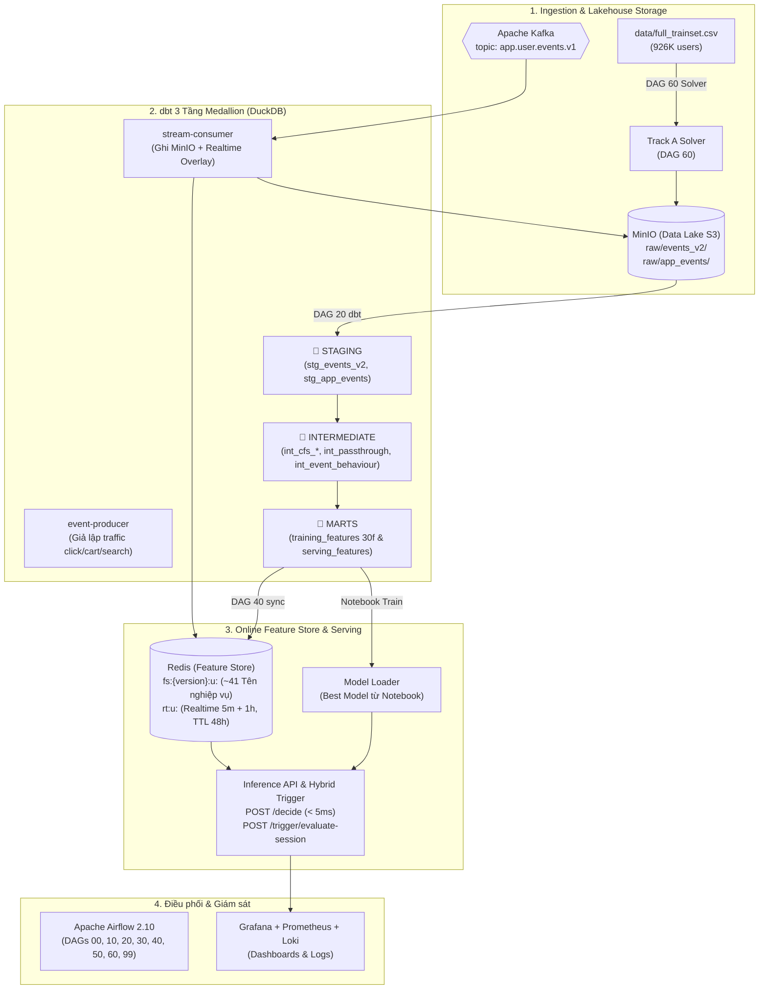

# Hướng dẫn chi tiết chạy luồng End-to-End & Kết nối các công cụ trong hệ thống

Tài liệu này giải thích chi tiết **bức tranh tổng thể**, **vai trò và cách kết nối của từng công cụ**, và **hướng dẫn thực thi chi tiết luồng dữ liệu chuẩn hóa** trong dự án Lazada Voucher Uplift Pipeline:
- **Track A (Event Reconstruction):** `Dataset CSV ➔ Track A Constraint Solver ➔ Sinh Raw Events E* (T < T0) ➔ MinIO Lakehouse (raw/events_v2) ➔ dbt Medallion 3 tầng ➔ DuckDB Marts (training_features & serving_features)`.
- **Feature Store & Serving:** `marts.serving_features ➔ DAG 40 Sync 32 Shards ➔ Redis Online Store (fs:{version}:u:{user_id}) ➔ FastAPI Inference & Hybrid Trigger Engine (< 5ms)`.
- **Track B (Near-Realtime Streaming):** `Live Events ➔ Kafka ➔ Stream Consumer ➔ MinIO (raw/app_events/) & Redis Realtime Overlay (rt:u:{user_id}, TTL 48h, sliding 5m)`.

---

## 📑 Mục Lục

1. [Bản đồ & Vai trò của các công cụ trong hệ thống](#1-bản-đồ--vai-trò-của-các-công-cụ-trong-hệ-thống)
2. [Hướng dẫn chạy Luồng Track A ➔ dbt 3 Tầng ➔ Redis Feature Store](#2-hướng-dẫn-chạy-luồng-track-a--dbt-3-tầng--redis-feature-store)
3. [Kiểm tra luồng Realtime Streaming (Kafka ➔ Redis Overlay)](#3-kiểm-tra-luồng-realtime-streaming-kafka--redis-overlay)
4. [Kiểm tra suy luận tại Inference API & Hybrid Trigger](#4-kiểm-tra-suy-luận-tại-inference-api--hybrid-trigger)
5. [Giám sát toàn diện trên Grafana & Prometheus](#5-giám-sát-toàn-diện-trên-grafana--prometheus)
6. [Bảng tổng hợp các lệnh thao tác nhanh](#6-bảng-tổng-hợp-các-lệnh-thao-tác-nhanh)

---

## 1. Bản đồ & Vai trò của các công cụ trong hệ thống



### Chi tiết vai trò của từng công cụ:

| Công cụ | Cổng / URL | Vai trò cụ thể trong Pipeline |
| :--- | :--- | :--- |
| **MinIO (S3 Lakehouse)** | `http://localhost:9001` *(minioadmin/minioadmin123)* | Kho lưu trữ Data Lake: lưu toàn bộ dữ liệu raw dưới dạng Parquet (`raw/events_v2/`, `raw/app_events/`). |
| **Apache Kafka** | `localhost:29092`<br/>UI: `http://localhost:8082` | Message Broker xử lý luồng stream sự kiện người dùng thời gian thực (`page_view`, `add_to_cart`, `search`, `checkout`). |
| **Event Producer & Stream Consumer** | *(Docker services)* | `producer` liên tục bắn sự kiện vào Kafka. `consumer` đọc từ Kafka, ghi Parquet vào MinIO và cập nhật counter 5m/1h vào Redis. |
| **DuckDB + dbt** | *(Chạy trong Airflow)* | Data Warehouse Engine & Transformation: đọc Parquet từ MinIO, thực hiện tính toán đặc trưng 3 tầng (Staging $\rightarrow$ Intermediate $\rightarrow$ Marts) và kiểm tra chất lượng dữ liệu. |
| **Redis** | `localhost:6379`<br/>UI: `http://localhost:5540` *(RedisInsight)* | **Online Feature Store**: Lưu trữ ~41 đặc trưng batch tên nghiệp vụ (`fs:{version}:u:...`) kết hợp với bộ đếm sự kiện realtime (`rt:u:...`) với TTL 48 giờ. |
| **FastAPI Inference & Hybrid Trigger** | `http://localhost:8000/docs` | API suy luận trực tuyến & Trigger: nhận `user_id`, đọc feature từ Redis trong 1 RTT, chạy mô hình để ra quyết định tặng `voucher_30`, `voucher_15` hoặc `no_voucher`. |
| **Apache Airflow** | `http://localhost:8080` *(admin/admin)* | Điều phối 8 DAGs workflow theo lịch trình hoặc sự kiện. |
| **Grafana & Prometheus** | `http://localhost:3000`<br/>`http://localhost:9090` | Thu thập chỉ số (metrics), cảnh báo và hiển thị trực quan toàn bộ hiệu năng hệ thống, độ trễ API, độ trễ Kafka, phân phối điểm Uplift. |

---

## 2. Hướng dẫn chạy Luồng Track A ➔ dbt 3 Tầng ➔ Redis Feature Store

### Bước 1: Khởi động toàn bộ Stack dịch vụ
```bash
make up-all
# Hoặc trên Windows PowerShell: .\scripts\stack.ps1 up-all
```
Kiểm tra sức khỏe: `make health` (tất cả endpoint trả về OK).

### Bước 2: Kích hoạt các DAGs theo thứ tự chuẩn
Mở Airflow Webserver tại **http://localhost:8080** (tài khoản: `admin` / `admin`):

```
[DAG 60_reconstruction_e2e] ──► [DAG 20_build_features_dbt] ──► [DAG 40_sync_features_to_redis] ──► [DAG 50_data_quality]
```

1. **`60_reconstruction_e2e`**: Solver Track A giải mã ngược dataset, sinh Raw Events ($E^*$) đẩy vào MinIO `raw/events_v2/` và sinh các bảng `biz.*`.
2. **`20_build_features_dbt`**: Chạy dbt 3 tầng chuyển đổi raw events và profile thành `marts.training_features` (30f) và `marts.serving_features` (tên nghiệp vụ).
3. **`40_sync_features_to_redis`**: Chia 32 shards ghi vào Redis (`fs:{version}:u:...`), validate 1000 mẫu và Atomic Swap `fs:meta:active_version`.
4. **`50_data_quality`**: Chạy dbt tests, kiểm tra schema drift và null rate.

---

## 3. Kiểm tra luồng Realtime Streaming (Kafka ➔ Redis Overlay)

Bắn các sự kiện mẫu vào Kafka và kiểm tra việc cập nhật tức thì trên Redis:

```bash
# 1. Bắn 1 sự kiện add_to_cart cho user U0000001
docker compose exec -T kafka kafka-console-producer \
  --bootstrap-server localhost:9092 \
  --topic app.user.events.v1 <<EOF
{"event_id": "evt_test_01", "user_id": "U0000001", "event_type": "add_to_cart", "event_ts": $(date +%s), "session_id": "s_01", "platform": "app"}
EOF

# 2. Kiểm tra Redis key realtime overlay (TTL 48h = ~172800s)
docker compose exec redis redis-cli hgetall rt:u:U0000001
docker compose exec redis redis-cli ttl rt:u:U0000001
```

---

## 4. Kiểm tra suy luận tại Inference API & Hybrid Trigger

### 4.1. Gửi request suy luận trực tiếp (`POST /decide`)
```bash
curl -X POST http://localhost:8000/decide \
     -H "Content-Type: application/json" \
     -d '{"user_id": "U0000001", "context": {"rt_page_view_5m": 3}}'
```

*Kết quả trả về:*
```json
{
  "user_id": "U0000001",
  "decision": "SEND_VOUCHER",
  "voucher_code": "voucher_30",
  "uplift_score": 0.0542,
  "threshold": 0.02,
  "feature_version": "v20260805",
  "model_version": "DRLearner-LightGBM",
  "cache_hit": true,
  "latency_ms": 2.1
}
```

### 4.2. Kích hoạt Hybrid Trigger đánh giá phiên in-session
```bash
curl -X POST http://localhost:8000/trigger/evaluate-session \
     -H "Content-Type: application/json" \
     -d '{"user_id": "U0000001"}'
```

---

## 5. Giám sát toàn diện trên Grafana & Prometheus

- **Grafana UI**: [http://localhost:3000](http://localhost:3000) (User: `admin` / Password: `admin`).
- **Các Dashboards có sẵn**:
  1. `01 - Feature Store & Redis Sync`: Theo dõi tiến độ sync 32 shards, số dòng ghi, tốc độ nạp Redis.
  2. `02 - Inference API & Model Performance`: Theo dõi RPS, P95/P99 latency, tỷ lệ Cache Hit, phân phối mã voucher.
  3. `03 - Data Quality & Drift Monitor`: Giám sát tỷ lệ null, phân phối đặc trưng.

---

## 6. Bảng tổng hợp các lệnh thao tác nhanh

| Thao tác | Lệnh thực thi |
|---|---|
| **Chạy toàn bộ Unit Tests** | `pytest tests/ -v` |
| **Khởi động Full Stack** | `make up-all` |
| **Dừng hệ thống** | `make down` |
| **Kiểm tra sức khỏe container** | `make health` |
| **Truy vấn DuckDB Marts** | `docker compose exec airflow-scheduler python -c "from lzd_pipeline.common.clients import duckdb_conn; con=duckdb_conn().__enter__(); print(con.execute('SELECT * FROM marts.serving_features LIMIT 5').fetchdf())"` |
| **Xem Redis Key** | `docker compose exec redis redis-cli hgetall fs:v20260805:u:U0000001` |
