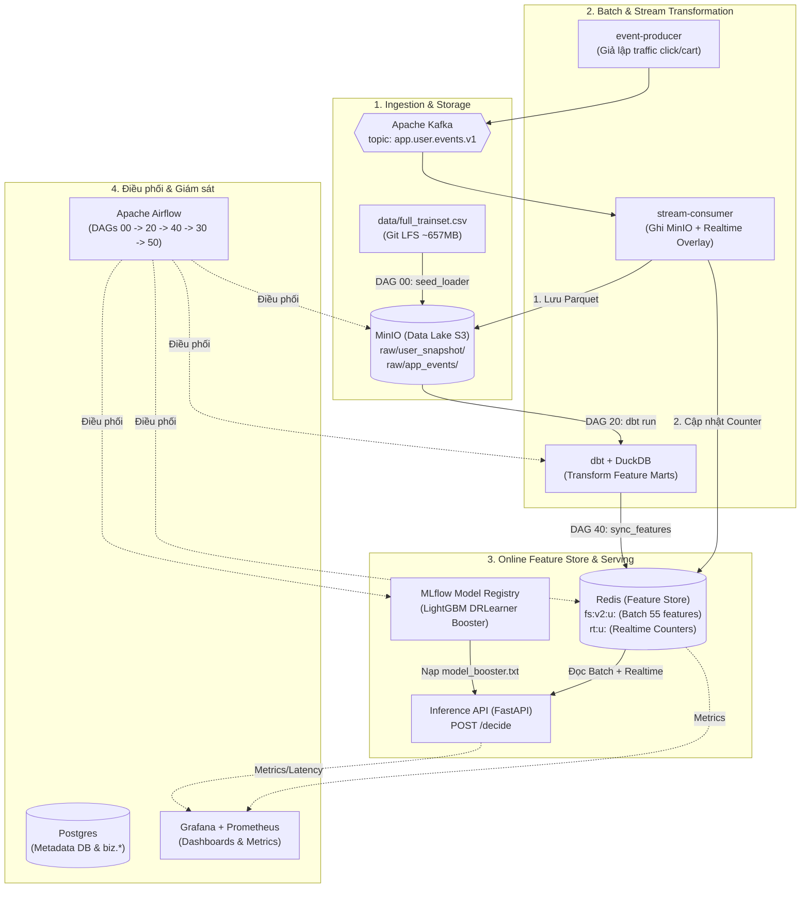

# Hướng dẫn chi tiết chạy luồng End-to-End & Kết nối các công cụ trong hệ thống

Tài liệu này giải thích chi tiết **bức tranh tổng thể**, **vai trò và cách kết nối của từng công cụ**, cũng như **từng bước chạy luồng dữ liệu End-to-End từ đầu đến cuối** trong dự án Lazada Voucher Uplift Pipeline.

---

## 1. Bản đồ & Vai trò của các công cụ trong hệ thống

Hệ thống được thiết kế theo kiến trúc **Modern Data & ML Platform** phục vụ bài toán tối ưu hoá phát voucher cá nhân hoá (Voucher Uplift Modeling):



### Chi tiết vai trò của từng công cụ:

| Công cụ | Cổng / URL | Vai trò cụ thể trong Pipeline |
| :--- | :--- | :--- |
| **PostgreSQL** | `localhost:5432` | Lưu metadata cho Airflow, MLflow; đồng thời chứa schema `biz.*` cho hệ thống Reconstruction. |
| **MinIO (S3 Lakehouse)** | `http://localhost:9001` *(minioadmin/minioadmin123)* | Kho lưu trữ Data Lake: lưu toàn bộ dữ liệu raw và staging dưới dạng Parquet (`raw/user_snapshot/`, `raw/app_events/`, `raw/track_b_future/`). |
| **Apache Kafka** | `localhost:29092`<br/>UI: `http://localhost:8082` | Message Broker xử lý luồng stream sự kiện người dùng thời gian thực (xem sản phẩm, thêm giỏ, áp mã voucher). |
| **Event Producer & Stream Consumer** | *(Docker services)* | `producer` liên tục bắn sự kiện vào Kafka. `consumer` đọc từ Kafka, ghi Parquet vào MinIO và cập nhật counter vào Redis. |
| **DuckDB + dbt** | *(Chạy trong Airflow)* | Data Warehouse Engine & Transformation: đọc Parquet từ MinIO, thực hiện tính toán đặc trưng (feature engineering) và kiểm tra chất lượng dữ liệu (`dbt test`). |
| **Redis** | `localhost:6379`<br/>UI: `http://localhost:5540` | **Online Feature Store**: Lưu trữ 55 đặc trưng batch (`fs:v2:u:...`) kết hợp với bộ đếm sự kiện thời gian thực (`rt:u:...`) với độ trễ dưới 2ms. |
| **MLflow** | `http://localhost:5001` | Quản lý vòng đời mô hình (Model Registry): lưu trữ artifact của mô hình **DR-Learner Uplift** (LightGBM 350 cây) và hợp đồng đặc trưng `feature_contract.json`. |
| **Inference API (FastAPI)** | `http://localhost:8000/docs` | API suy luận trực tuyến: nhận `user_id`, đọc feature từ Redis, tự động tính toán 7 cột phái sinh, gọi LightGBM booster để tính điểm uplift ($\tau = P(\text{buy}\mid\text{treat}) - P(\text{buy}\mid\text{control})$). |
| **Apache Airflow** | `http://localhost:8080` *(admin/admin)* | Nhạc trưởng điều phối toàn bộ workflow theo lịch trình hoặc sự kiện. |
| **Grafana & Prometheus** | `http://localhost:3000`<br/>`http://localhost:9090` | Thu thập chỉ số (metrics), cảnh báo và hiển thị trực quan toàn bộ hiệu năng hệ thống, độ trễ API, độ trễ Kafka, phân phối điểm Uplift. |

---

## 2. Hướng dẫn từng bước chạy luồng End-to-End

### Bước 1: Khởi động toàn bộ Stack dịch vụ

Chạy lệnh sau trên terminal tại thư mục gốc của repo:

```bash
# Khởi động toàn bộ hệ thống (Infrastructure + Streaming + ML + Observability)
make up-all
```
*(Hoặc nếu máy cấu hình yếu, bạn có thể dùng `make up-core` để tắt bớt các container observability).*

Kiểm tra trạng thái sẵn sàng của các dịch vụ:
```bash
make health
```
> Nếu tất cả endpoint đều trả về mã `200` (hoặc `OK`), hệ thống đã sẵn sàng.

---

### Bước 2: Kích hoạt các DAG trong Airflow theo thứ tự

Mở trình duyệt truy cập Airflow Webserver tại **http://localhost:8080** (tài khoản: `admin`, mật khẩu: `admin`).

Kích hoạt và trigger chạy lần lượt các DAG theo thứ tự chuẩn:

```
[DAG 00] ──► [DAG 20] ──► [DAG 40] ──► [DAG 30] ──► [DAG 50]
Bootstrap     Build dbt    Sync Redis   ML Registry   Data Quality
```

#### 1. DAG `00_bootstrap_lake`:
- **Nhiệm vụ:** Đọc dữ liệu từ `data/full_trainset.csv` và nạp vào MinIO Lakehouse tại đường dẫn `s3://lakehouse/raw/user_snapshot/dt=2026-08-05/train.parquet`.
- **Cách chạy:** Bấm nút **Trigger DAG** trên giao diện Airflow.

#### 2. DAG `20_build_features_dbt`:
- **Nhiệm vụ:** Chạy dbt model trên DuckDB để chuyển đổi dữ liệu từ snapshot thô sang các bảng đặc trưng (`feat_user_selected_serving` với 55 cột đặc trưng được chọn).
- **Cách chạy:** Trigger sau khi DAG `00` hoàn tất.

#### 3. DAG `40_sync_features_to_redis`:
- **Nhiệm vụ:** Đọc 55 đặc trưng từ bảng dbt, ghi vào Redis theo batch key `fs:v2:u:{user_id}`, sau đó hoán đổi con trỏ active `fs:meta:active_version` sang phiên bản mới mà không gây gián đoạn serving (Zero-downtime swap).
- **Cách chạy:** Trigger sau khi DAG `20` hoàn tất.

#### 4. DAG `30_train_uplift_model` *(Tuỳ chọn - Retrain)*:
- **Nhiệm vụ:** Huấn luyện lại mô hình Uplift định kỳ hàng tuần từ dữ liệu mart mới và đăng ký version mới vào MLflow Model Registry.
- **Lưu ý:** Model chuẩn (`model_booster.txt` 350 cây) **đã được đóng gói sẵn** trong thư mục `models/uplift_voucher/` và tự động mount vào container `inference-api`. Do đó, DAG này mặc định ở trạng thái `PAUSED` và **không bắt buộc phải chạy** để API phục vụ suy luận.

#### 5. DAG `50_data_quality`:
- **Nhiệm vụ:** Chạy toàn bộ các bài kiểm thử chất lượng dữ liệu dbt tests, kiểm tra schema, phát hiện null và kiểm tra bất biến không bị nhiễm dữ liệu synthetic.
- **Cách chạy:** Trigger để nghiệm thu toàn bộ pipeline dữ liệu.

---

### Bước 3: Kiểm tra luồng Realtime Streaming

Sau khi `make up-all` được chạy, hai container `event-producer` và `stream-consumer` đã tự động vận hành trong nền:

1. **Xem log Producer đang gửi event vào Kafka:**
   ```bash
   make logs s=event-producer
   ```
2. **Xem log Consumer đang nhận event, lưu vào MinIO và ghi đè counter vào Redis:**
   ```bash
   make logs s=stream-consumer
   ```
3. **Mở giao diện Kafka UI:**
   - Truy cập **http://localhost:8082**.
   - Xem topic `app.user.events.v1` với các sự kiện realtime đang được nạp liên tục.

---

### Bước 4: Kiểm tra suy luận tại Inference API (FastAPI)

Truy cập Swagger UI của Inference API tại: **http://localhost:8000/docs**.

#### 1. Kiểm tra trạng thái Model & Feature Store:
Gửi request `GET /store/info`:
```bash
curl -s http://localhost:8000/store/info | python -m json.tool
```
*Kết quả phản hồi sẽ xác nhận `is_stub: false`, `feature_count: 76` và model version `DRLearner-20260813` đang hoạt động.*

#### 2. Thử nghiệm ra quyết định tặng Voucher (`POST /decide`):
```bash
curl -X POST http://localhost:8000/decide \
  -H "Content-Type: application/json" \
  -d '{"user_id": "U0000001"}' | python -m json.tool
```
**Luồng xử lý ngầm của API:**
1. Đọc 55 đặc trưng batch từ Redis key `fs:v2:u:U0000001`.
2. Đọc các bộ đếm realtime từ Redis key `rt:u:U0000001` (nếu có hành vi mới vừa xảy ra trong 1 giờ qua).
3. Hợp nhất hai nguồn dữ liệu.
4. Tự động tính toán 7 cột phái sinh (`fe_ratio_*`, `fe_inter_*`, `fe_flag_sum`) và 14 giá trị mặc định theo hợp đồng 76 chiều.
5. Gọi LightGBM Booster tính điểm `uplift_score`.
6. Ra quyết định: nếu `uplift_score > threshold` $\rightarrow$ `decision = "SEND_VOUCHER"`.

#### 3. Bắn tải thử nghiệm (Load test):
```bash
make load-test
```
*Lệnh này sẽ bắn 20 request/giây liên tục trong 60 giây để kiểm tra độ ổn định và độ trễ của API.*

---

### Bước 5: Giám sát toàn diện trên Grafana & Prometheus

Mở trình duyệt truy cập:
- **Grafana:** **http://localhost:3000** (tài khoản: `admin`, mật khẩu: `admin`).
  - Mở dashboard **LZD Pipeline & Serving Overview**.
  - Bạn sẽ thấy: Throughput API, Phân vị độ trễ p95/p99 (< 5ms), Tỉ lệ Cache Hit của Redis, Biểu đồ phân phối điểm Uplift Score, Tốc độ tiêu thụ message của Kafka.
- **Prometheus:** **http://localhost:9090**.

---

### Bước 6: Chạy luồng Reconstruction (Khám phá quá khứ & Giả lập tương lai)

Hệ thống cung cấp cơ chế giải mã ngược dữ liệu phục vụ nghiên cứu & kiểm định:

#### 1. Dựng lại sự kiện quá khứ (Track A) trên 1,000 người dùng thật:
```bash
make track-a
```
*Dữ liệu sự kiện được giải mã và lưu tại thư mục `.tmp/reconstruction_track_a/`.*

#### 2. Chạy cả Quá khứ (Track A) + Tương lai (Track B) trên người dùng thật:
```bash
PYTHONPATH=src .venv/bin/python -m lzd_pipeline.reconstruction.track_ab_batch --limit 10
```
*Dựng lại quá khứ $\rightarrow$ tính `CustomerState(T0)` $\rightarrow$ mô phỏng 2 ngày tương lai cho 10 user.*

#### 3. Sinh báo cáo Snapshot trực quan:
```bash
make snapshot
```
*Xem báo cáo trực quan kèm biểu đồ timeline tại [docs/reconstruction_snapshot/report.html](file:///Users/user/Intern/LZD/docs/reconstruction_snapshot/report.html).*

#### 4. Chạy kịch bản tích hợp toàn diện (Track A ➔ Redis ➔ Track B ➔ Kafka ➔ Consumer ➔ API):
```bash
PYTHONPATH=src .venv/bin/python scripts/demo_track_ab_e2e.py
```
*Kịch bản này tự động thực hiện trọn vẹn 5 bước: Giải mã quá khứ Track A $\rightarrow$ Xác nhận 55 features trên Redis $\rightarrow$ Mô phỏng tương lai Track B $\rightarrow$ Bắn sự kiện vào Kafka để Consumer cập nhật Realtime Overlay vào Redis $\rightarrow$ Gọi API `/decide` để Model thật đưa ra quyết định phát voucher.*

---

## 3. Bảng tổng hợp các lệnh thao tác nhanh

```bash
# Khởi động & kiểm tra
make up-all       # Khởi động toàn bộ stack
make status       # Xem danh sách container & link UI
make health       # Kiểm tra sức khỏe tất cả endpoint
make logs s=api   # Xem log của inference-api (hoặc s=stream-consumer, s=airflow-scheduler)

# Kiểm thử & chạy thử
make test         # Chạy toàn bộ 324 unit & contract tests
make load-test    # Bắn traffic tải vào inference API
make snapshot     # Sinh reconstruction snapshot báo cáo
make track-a      # Chạy Track A backfill trên 1000 user thật

# Dừng & dọn dẹp
make down         # Dừng các container (giữ nguyên dữ liệu)
make reset        # Dừng và xoá sạch volume dữ liệu (làm lại từ đầu)
```
