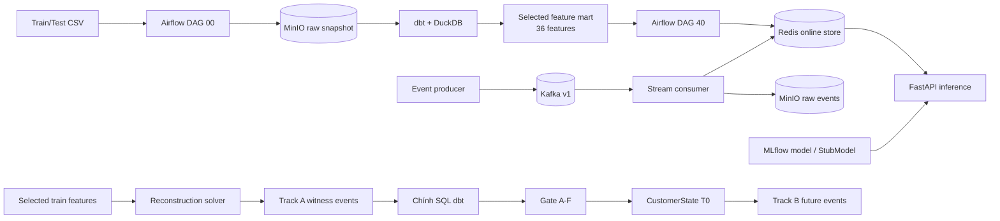

# Tech Doc WIP 4 tuần — LZD Uplift Feature Platform

> **Kỳ báo cáo:** 4 tuần kết thúc ngày 2026-08-15
> **Mốc code đang review:** `main@3286ccc`
> **Trạng thái:** WIP, dùng cho technical review và demo nội bộ
> **Phạm vi bằng chứng:** lịch sử Git hiện có bắt đầu từ 2026-08-11. Tài liệu
> không suy diễn công việc cho những ngày trước mốc này.

## 1. Tóm tắt điều hành

Trong kỳ báo cáo, dự án đã hình thành một nền tảng local end-to-end cho bài
toán Lazada voucher uplift, bao gồm:

- pipeline batch `CSV -> MinIO -> dbt/DuckDB -> Redis`;
- pipeline realtime `Kafka -> MinIO -> Redis realtime overlay`;
- orchestration bằng Airflow, monitoring bằng Prometheus/Grafana/Loki;
- feature contract cho 36 feature trên `main`;
- reconstruction dry-run từ feature về event witness, chạy lại chính SQL dbt,
  kiểm tra Gate A–F, dựng `CustomerState(T0)` và sinh Track B;
- API inference và MLflow integration surface.

Thành phẩm ổn định nhất để demo trên `main` là **reconstruction snapshot 36
feature**. Snapshot đã commit cho thấy 5 Track A events, 8 Track B events và
toàn bộ Gate A–F đều pass.

Hai nhánh WIP đã đi xa hơn `main` nhưng chưa merge:

- `origin/feat/scope-55f`: mở reconstruction/feature store từ 36 lên 55 feature;
- `origin/feat/uplift-model-55f`: lắp DRLearner + LightGBM vào training và
  serving trên scope 55 feature.

Kết luận hiện tại: **đã đủ để review kiến trúc và demo reconstruction cơ bản**;
chưa đủ bằng chứng để gọi là production-ready vì nhánh 55 feature/model chưa
merge và các đường ghi vào Postgres/MinIO/MLflow thật chưa được chạy đầy đủ
trong một full-stack environment.

## 2. Mục tiêu và phạm vi

### 2.1 Mục tiêu

1. Tái tạo pipeline dữ liệu uplift trên local để developer/reviewer quan sát
   được data flow và contract giữa các tầng.
2. Đồng bộ một tập feature có kiểm soát lên online store, thay vì đẩy toàn bộ
   `f0..f82` không có ownership rõ ràng.
3. Kiểm chứng feature reconstruction bằng forward pass độc lập qua chính SQL
   dbt đang dùng để build feature.
4. Chuẩn bị integration surface cho training, model registry và inference API.

### 2.2 Ngoài phạm vi đã hoàn tất trên `main`

- Chưa publish Track B production lên Kafka topic v2.
- Chưa materialize reconstruction full dataset thành production source of truth.
- Chưa có model thật trong inference path của `main`; API vẫn fallback về
  `StubModel`.
- Chưa chứng minh full stack chạy ổn định liên tục trong môi trường production.

## 3. Kiến trúc hiện tại trên `main`



Hai đường forward và reconstruction dùng chung feature semantics nhưng có
boundary riêng. Reconstruction dry-run không ghi vào MinIO, Kafka, Redis hay
Postgres production.

## 4. Thành phần kỹ thuật đã có

| Thành phần | Implementation | Trạng thái trên `main` |
|---|---|---|
| Batch ingestion | Airflow DAG 00, `seed_loader.py`, MinIO parquet | Đã có |
| Feature engineering | 3 staging + 6 marts model trong dbt/DuckDB | Đã có |
| Selected feature store | 36 feature, versioned Redis key, atomic active pointer | Đã có |
| Realtime ingestion | Kafka v1, schema validation, DLQ, MinIO, Redis overlay | Đã có |
| Orchestration | 8 Airflow DAG | Đã có |
| Observability | Prometheus, Grafana, Loki, exporters, 5 dashboard | Đã có |
| Reconstruction | Track A, dbt forward pass, Gate A–F, T0, Track B | Demo được |
| Inference API | FastAPI, feature merge, metrics, health/readiness | Có integration surface |
| Uplift model | Training/MLflow loader là TODO, có `StubModel` fallback | Chưa hoàn tất trên `main` |

Runtime được chia theo Docker Compose profile:

| Profile | Vai trò |
|---|---|
| `core` | Postgres, Redis, MinIO, Kafka, Airflow |
| `stream` | event producer và stream consumer |
| `serving` | inference API |
| `ml` | MLflow |
| `obs` | Prometheus, Grafana, Loki và các UI/exporter |
| `all` | toàn bộ stack |

## 5. Data flow và contract chính

### 5.1 Batch feature flow

```text
data/full_trainset.csv + data/full_testset.csv
  -> raw/user_snapshot parquet trên MinIO
  -> dbt staging
  -> marts.feat_user_selected_serving
  -> Redis fs:{version}:u:{user_id}
  -> fs:meta:active_version
```

`feature_spec.yml` quản lý schema phục vụ sync/inference. Trên `main`, selected
feature set reconstruction là `fs_2026_08_v1` với 36 cột.

### 5.2 Realtime flow

```text
event-producer
  -> Kafka app.user.events.v1
  -> stream-consumer
  -> MinIO raw/app_events + Redis rt:u:{user_id}
```

Consumer dùng at-least-once delivery. Lake deduplicate bằng `event_id`, nhưng
realtime counter có khả năng cộng dư khi replay. Vì vậy lake vẫn là source of
truth; Redis realtime overlay chỉ là tín hiệu độ trễ thấp.

### 5.3 Reconstruction flow

```text
36 selected features
  -> semantic branch H1/H2
  -> solver chọn canonical candidate
  -> Track A witness events
  -> render và chạy chính SQL dbt trong DuckDB
  -> so expected/actual tại Gate A và A-T3
  -> Gate B-F về handoff, provenance và isolation
  -> CustomerState(T0)
  -> Track B future events
```

Nguyên tắc quan trọng: forward engine không viết lại công thức dbt bằng Python.
Runner thực thi chính SQL dbt để tránh một closed-loop test tự kiểm tra chính
implementation của nó.

## 6. Kết quả WIP trong kỳ báo cáo

Do repository chỉ có lịch sử từ ngày 2026-08-11, tiến độ dưới đây được trình
bày theo mốc có bằng chứng thay vì chia giả định thành bốn tuần.

| Ngày | Mốc | Kết quả chính |
|---|---|---|
| 2026-08-11 | Platform baseline | Dựng ingestion, dbt, feature sync, Airflow, serving surface, observability và local stack |
| 2026-08-13 | Reconstruction E2E | Bổ sung solver, Track A/B, Gate A–F, snapshot, DAG 60 và bộ tài liệu reconstruction |
| 2026-08-14 | Stabilization | Pin dependency cho Windows/Python mới, sửa snapshot/temp-dir và ghi nhận 210 test pass trên `main` |
| 2026-08-14 | Scope 55 feature | Nhánh `feat/scope-55f` mở scope lên 55, thêm constructive solver và production-shaped sink |
| 2026-08-14 | Model integration | Nhánh `feat/uplift-model-55f` lắp DRLearner/LightGBM, feature contract 76 input và MLflow loader |

### 6.1 So sánh trạng thái các nhánh

| Nhánh / commit | Feature online | Model serving | Bằng chứng test được ghi trong nhánh | Merge status |
|---|---:|---|---:|---|
| `main@3286ccc` | 36 | Stub/TODO | `210 passed` | Baseline hiện tại |
| `origin/feat/scope-55f@19f5b71` | 55 | Stub/TODO | `280 passed` | Chưa merge |
| `origin/feat/uplift-model-55f@dcd8a26` | 55 | DRLearner + LightGBM | `325 passed, 1 skipped` | Chưa merge |

Các số trên là kết quả được ghi trong README/Tech Reference của từng commit,
không phải một test run duy nhất trên cùng environment.

### 6.2 Điểm đáng chú ý của nhánh 55 feature/model

- Scope v2 là superset của v1: 55 feature thay cho 36.
- Model nhận 76 đầu vào: 55 từ Redis, 7 feature dẫn xuất tại serving và 14
  feature điền giá trị mặc định theo contract.
- Golden prediction của serving branch được ghi nhận khớp bit-for-bit với
  artifact model gốc.
- DRLearner dẫn đầu theo quy trình benchmark đã lưu, nhưng khoảng tin cậy 95%
  của Qini vẫn chứa 0. Vì vậy kết quả chưa đủ để khẳng định uplift có ý nghĩa
  thống kê trong production.
- Một test training end-to-end được ghi nhận là `skipped` do dependency host;
  đường đăng ký MLflow thật cũng chưa chạy với server đầy đủ.

## 7. Bằng chứng kiểm chứng

### 7.1 Committed reconstruction snapshot trên `main`

Nguồn: `docs/reconstruction_snapshot/summary.json`.

| Chỉ số | Kết quả |
|---|---|
| Feature set | `fs_2026_08_v1` |
| Số selected feature | 36 |
| Semantic branch | H1 |
| Semantic status | `UNIDENTIFIED` |
| Track A | `SOLVED`, 5 events |
| Track B | 8 events |
| Gate A, A-T3, B, C, D, E, F | Tất cả `true` |
| Tổng kết | `all_passed: true` |
| Seed | 42 |

`UNIDENTIFIED` không có nghĩa solver thất bại. Nó cho biết business alias đang
là giả định synthetic, chưa được xác nhận là Lazada business fact.

Artifact phục vụ review:

- `docs/reconstruction_snapshot/report.html`;
- `docs/reconstruction_snapshot/feature_pass.svg`;
- `docs/reconstruction_snapshot/timeline.svg`;
- `docs/reconstruction_snapshot/features_expected_actual.csv`;
- `docs/reconstruction_snapshot/track_a_events.csv`;
- `docs/reconstruction_snapshot/track_b_events.csv`.

### 7.2 Test status tại thời điểm viết tài liệu

- Commit `main@3286ccc` ghi nhận `python -m pytest tests/ -q` trả về
  `210 passed` ngày 2026-08-14.
- Lần chạy lại ngày 2026-08-15 trên workspace hiện tại dừng ở test collection
  vì Python environment thiếu package `duckdb` (`ModuleNotFoundError`). Không
  có assertion test nào được chạy trong lần này.
- Cách tái kiểm tra đúng là cài `requirements-dev.txt` trong virtual environment
  sạch rồi chạy lại toàn bộ suite.

## 8. Kịch bản demo cơ bản (10–15 phút)

### 8.1 Mục tiêu demo

Chứng minh ba điểm:

1. Repo có contract rõ cho selected features.
2. Reconstruction sinh được event witness từ feature target.
3. Chính SQL dbt tái tạo lại feature và toàn bộ gate đều pass.

### 8.2 Chuẩn bị không cần Docker

PowerShell:

```powershell
python -m venv .venv
.\.venv\Scripts\Activate.ps1
python -m pip install --upgrade pip
pip install -r requirements-dev.txt
$env:PYTHONPATH = "src"
```

Bash/zsh:

```bash
python -m venv .venv
source .venv/bin/activate
python -m pip install --upgrade pip
pip install -r requirements-dev.txt
export PYTHONPATH=src
```

### 8.3 Luồng demo đề xuất

**Bước 1 — giới thiệu snapshot đã commit (2 phút)**

Mở `docs/reconstruction_snapshot/report.html`, chỉ ra:

- target feature;
- timeline Track A/Track B;
- bảng expected/actual;
- trạng thái Gate A–F.

**Bước 2 — chạy lại reconstruction (3 phút)**

PowerShell:

```powershell
powershell -ExecutionPolicy Bypass -File .\scripts\stack.ps1 reconstruction H1
```

Bash/zsh:

```bash
make reconstruction
```

Expected result: Track A ở trạng thái `SOLVED`, feature comparison pass và
Gate A–F đều xanh.

**Bước 3 — sinh lại review artifact (2 phút)**

```bash
make snapshot
```

Hoặc trên Windows:

```powershell
powershell -ExecutionPolicy Bypass -File .\scripts\stack.ps1 snapshot H1
```

Expected result: các file trong `docs/reconstruction_snapshot/` được tạo lại,
`summary.json` có `all_passed: true`.

**Bước 4 — chạy bộ test (2–5 phút)**

```bash
make test
```

Hoặc:

```powershell
powershell -ExecutionPolicy Bypass -File .\scripts\stack.ps1 test
```

**Bước 5 — chốt phần WIP (2 phút)**

Giải thích rằng `main` đang là baseline 36 feature. Nhánh 55 feature/model là
phần tiếp theo cần review và merge; không trình bày chúng như production state.

### 8.4 Demo full stack tùy chọn

Nếu Docker Desktop và image registry hoạt động:

```bash
cp .env.example .env
make up-all
make status
make health
```

Các UI chính:

| UI | URL |
|---|---|
| Airflow | `http://localhost:8080` |
| Grafana | `http://localhost:3000` |
| MinIO | `http://localhost:9001` |
| Kafka UI | `http://localhost:8082` |
| MLflow | `http://localhost:5000` |
| Inference API | `http://localhost:8000/docs` |

Không nên phụ thuộc vào full-stack demo cho buổi review đầu tiên. Offline
reconstruction là đường ngắn nhất, ít dependency nhất và trực tiếp chứng minh
contract quan trọng nhất của WIP.

## 9. Rủi ro và khoảng trống

| Mức độ | Vấn đề | Ảnh hưởng | Hành động đề xuất |
|---|---|---|---|
| Cao | Nhánh 55 feature/model chưa merge | Demo `main` chưa phản ánh model thật | Review, rebase và merge theo từng lát nhỏ |
| Cao | Chưa chạy production-shaped sink với Postgres/MinIO thật | Chưa có bằng chứng integration full stack | Chạy E2E trên environment sạch và lưu run evidence |
| Cao | Model uplift chưa chứng minh ý nghĩa thống kê | Có nguy cơ quyết định voucher không tạo incremental lift | Shadow mode/A-B test trước khi phát voucher thật |
| Trung bình | DAG 20 và DAG 40 phụ thuộc bằng lịch chạy 01:00/01:30 | DAG 20 chậm có thể khiến DAG 40 sync feature cũ | Dùng Airflow Dataset hoặc `ExternalTaskSensor` |
| Trung bình | Redis realtime counter có thể cộng dư khi Kafka replay | Training/serving skew ngắn hạn | Thiết kế idempotency hoặc recompute từ lake |
| Trung bình | Business aliases là synthetic assumption | Không được diễn giải thành Lazada business fact | Xác nhận với domain owner và version semantic artifact |
| Thấp | Local test chưa chạy lại do thiếu `duckdb` | Chưa có fresh evidence trên máy hiện tại | Tạo virtual environment và cài dev requirements |

## 10. Đề xuất kế hoạch tiếp theo

1. Tạo environment sạch, chạy lại test của `main`, scope-55f và model branch;
   lưu command, Python version và kết quả vào CI artifact.
2. Merge scope 55 feature trước; kiểm lại dbt contract, Redis sync và
   reconstruction snapshot.
3. Merge model serving/training sau; chạy golden prediction và smoke test API.
4. Dựng full stack, chạy một luồng thật từ bootstrap đến Redis và `/decide`.
5. Chạy `register.py` với MLflow/MinIO thật, kiểm tra reload và rollback model.
6. Chạy shadow traffic; chỉ mở quyết định voucher thật sau khi có guardrail và
   kết quả thử nghiệm uplift.

## 11. Definition of Done cho mốc kế tiếp

Mốc kế tiếp được xem là hoàn tất khi:

- `main` chứa scope 55 feature và model serving đã review;
- toàn bộ test chạy xanh trong CI, không có skip không được giải thích;
- reconstruction snapshot mới được sinh từ đúng commit release;
- bootstrap, dbt build, Redis sync và inference smoke test chạy trong cùng một
  full-stack environment;
- model artifact được đăng ký vào MLflow với version, feature contract và
  rollback procedure;
- known gaps còn lại được gắn owner và deadline.

## 12. Tài liệu liên quan

- [README](../README.md)
- [Pipeline Architecture](PIPELINE_ARCHITECTURE.md)
- [Tech Reference](TECH_REFERENCE.md)
- [Data Flow](DATA_FLOW.md)
- [Feature Lineage](FEATURE_LINEAGE.md)
- [Reconstruction Spec](RECONSTRUCTION_SPEC.md)
- [Reconstruction Contract](RECONSTRUCTION_CONTRACT.md)
- [Reconstruction Runbook](RECONSTRUCTION_README.md)
- [Operations Runbook](RUNBOOK.md)

Tài liệu chỉ tồn tại trên nhánh WIP có thể xem mà không checkout bằng:

```bash
git show origin/feat/scope-55f:docs/SCOPE_EXPANSION_55F.md
git show origin/feat/uplift-model-55f:docs/UPLIFT_MODEL.md
```
