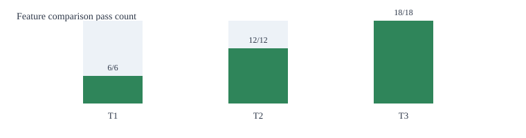
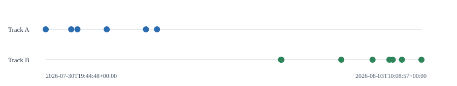

# Reconstruction Snapshot

Small committed artifact for reviewing the deterministic reconstruction dry-run.

The charts below render directly in GitHub. Open `report.html` locally for the
full table view.





Files:

- `track_a_events.csv`: reconstructed Track A witness events.
- `track_b_events.csv`: future synthetic Track B events from `CustomerState(T0)`.
- `features_expected_actual.csv`: expected vs actual for the 36 selected features.
  It includes synthetic business aliases from `config/features/business_aliases.yml`.
- `feature_pass.svg`: pass-count chart by feature tier.
- `timeline.svg`: Track A/Track B event timeline.
- `summary.json`: gate summary.
- `manifest.json`: runtime config, versions, and file checksums.

Snapshot ID:

```text
reconstruction_runtime_v1:H1:demo-target-001:seed42
```

This is a review fixture, not production MinIO/Kafka/Redis data. Regenerate it
only when the reconstruction contract, selected feature set, seed, or runtime
config changes:

```powershell
powershell -ExecutionPolicy Bypass -File .\scripts\stack.ps1 snapshot
```
